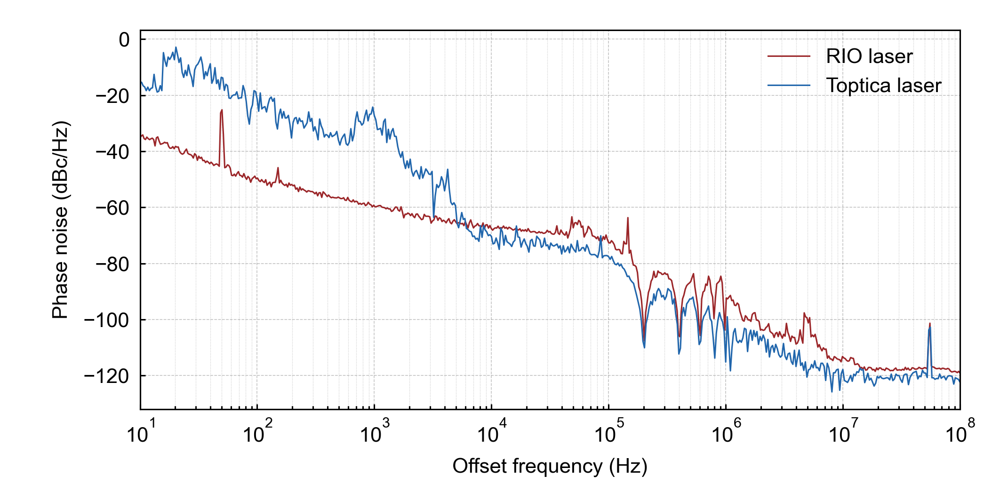
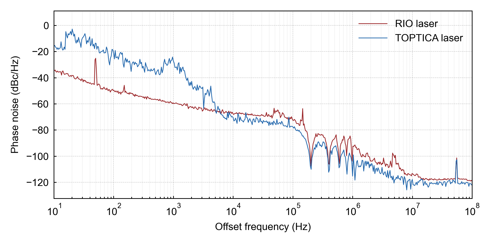

# README

**This repository includes a reusable agent skill for publication-ready scientific plots, with a small demo project.**

## Structure

- `scientific-plotting/` is the skill package. Import it to your workspace as needed.

- `demo/` is a small demo project for trying the skill quickly:

  1. Open a terminal in `demo/`

  2. Ask the AI to plot data from `data/`

  3. The plotting script is written to `scripts/`

  4. The figure is exported to `output/`


## Usage

Example prompt (Flexible, free-form natural language):

```text
Read data from the `data/` folder and create a scientific plot using only raw data.
Set the x-axis range to `1e1` - `1e8`, use the skill color palette, and export to `output/`.
```

## Example Results

- Both Chinese and English prompts work.
- Model: Codex GPT-5.4, medium reasoning
- Results generated by running in the `demo/` folder

**Prompt 1:**

```text
读取 `data` 文件夹中的数据，仅使用 raw 数据进行科研绘图。将横坐标范围设为 1e1 - 1e8，使用 skill 中的配色，并将结果导出到 `output/`。
```



**Prompt 2:**

```text
Read data from the `data/` folder and use only raw data for scientific plotting.
Set the x-axis range to `1e1` - `1e8`, use the color scheme defined by the skill, and export the results to `output/`.
```



With the `scientific-plotting` skill, the LLM maintains a consistent plot style across two independent trials.

> The data was acquired directly from a electrical spectrum analyzer using a delayed self-heterodyne setup with a 5 µs delay, characterizing both one RIO PLANEX™ 1550 nm and a TOPTICA CTL 1550 lasers. Please note that the measurement conditions do not necessarily reflect the optimal linewidth performance of these lasers.

## Limitations

- Current support is limited to basic curve plots.
- Image size constraints are currently insufficient; the plotting area dimensions may not be uniform across exported figures.
- Advanced plot types, including heatmaps, violin plots, and 3D visualizations, are currently unavailable.